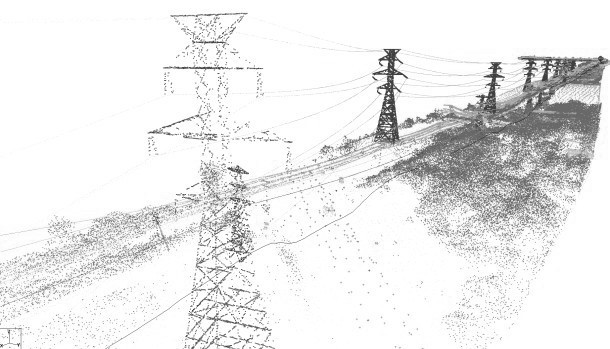
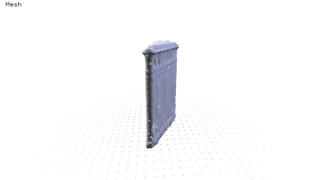

## Non traditional 3D Mapping
##### From pointClouds to GeoJSON Polygons

<iframe src="//player.vimeo.com/video/111857991?title=0&amp;byline=0&amp;portrait=0" width="575" height="323" frameborder="0" webkitallowfullscreen mozallowfullscreen allowfullscreen></iframe>

I know nothing about cartography, beside the general understanding that the earth is not flat but maps are. That there are complicated equations, call projections, to make measurements “feet” in a two dimensional representations usually call map. That’s all.  

I had spend the last month exploring how points cloud can be use on mapping. Why point clouds? Well, I know some Computer Graphics and starting from it seams like the most intuitive way of learning. This article is a documentation of a series of Python and C++ sketches that illustrate my process of the last month.


### Working with Point Clouds

PointClouds are not new, but are pretty much on trending right now. New devices together with the capabilities of storing more date are making this technology more and more common. For me this adventure start on 2011 when I acquire a Microsoft Kinect camera. A cheap and easy to hack devices that use structured light to get depth information of a stream of video. Making point clouds of it was easy and gratifying.

The new products where presented to the market like Google’s [Tango Project](https://www.google.com/atap/projecttango/#project), [Leap Motion](https://www.leapmotion.com/) and [Structure](http://structure.io/). Together with the hardware new open software was develop, like 
[freenect](http://openkinect.org/wiki/Main_Page), [openNI](http://structure.io/openni) and [libPCL](http://pointclouds.org/).

A new generation of artist is playing with this stuff pushing the boundaries of the expressive potential of this technology.

#### LIDar data


Way before the Kinect came to the market, point clouds where use to map thanks to a technology develop on the earlier ’60 call Lidar (Light Detection and Ranging). It consist basically on an expensive laser mounted under planes that send pulses of laser light to the surface of a terrain measuring the distance. That information then is geolocated using precise GPS information, the result is a set of millions of points each one perfectly geolocated in 3D space. There are a couple of programs that let you see and edit this big data set, the best open source application I found was [CloudCompare](http://www.danielgm.net/cc/).



This data can be use to make maps as is shown in [Yuriy Czoli’s tutorial](https://gist.github.com/YKCzoli/3605e014b8ed09a571e5) using openSource software. In it Yuriy explain how to port the points to a PostGIS server and then using QGIS extract and use those points. The final touch is to extract the maximum altitud of the points for each building, that information can be feed to [OpenStreetMap](http://www.openstreetmap.org/). Is that data (the polygons and height per building) what we use in [Mapzen](www.mapzen.com) to generate our 3D maps in [tangram](https://mapzen.com/tangram#mapzen,40.70531887544228,-74.00976419448854,16).


But this is not the path I follow. Coming from a more artistic approach and not knowing much about GIS, I decide to try my own way into this technology. For that I made a series of scripts and tools in this [repository](https://github.com/tangrams/LIDar-tools) to teach my self how to convert Lidar data to other formats, [export it to PostGIS](https://gist.github.com/patriciogonzalezvivo/229c5cd4001c2ed45ec6) and finally extract single buildings by query.

#### Making point-clouds from pictures

While I was proud of my own set of [lidar tools](https://github.com/tangrams/LIDar-tools) thought “How owns a LIDar?”. Well they are expensive devices. I don’t hove one, nobody I know have one.

That’s where photogrammetry came to my mind. This is also a relative old technology ( presented around the 2006), photogrammetry aims to construct 3D point clouds just from photographies. 


Probably the most famous is applications of this technology are [PhotoSynth](https://photosynth.net/) and [123D Catch](http://www.123dapp.com/catch). But the real deal is the open source project call [Bundler](http://www.cs.cornell.edu/~snavely/bundler/).

<iframe width="575 src="//www.youtube.com/embed/vpTEobpYoTg" frameborder="0" allowfullscreen></iframe>

“*Bundler takes a set of images, image features, and image matches as input, and produces a 3D reconstruction of camera and (sparse) scene geometry as output. The system reconstructs the scene incrementally, a few images at a time, using a modified version of the [Sparse Bundle Adjustment](http://users.ics.forth.gr/~lourakis/sba/) package of Lourakis and Argyros as the underlying optimization engine. Bundler has been successfully run on many Internet photo collections, as well as more structured collections*.”

So I start taking pictures, lots and lots of pictures of the Flatiron. Why the Flatiron, well is two blocks from my work and is perfectly isolated, so I can take all the pictures I want around it.


[Bundler](http://www.cs.cornell.edu/~snavely/bundler/) and [Furukawa’s CMVS algorithm](http://www.di.ens.fr/cmvs/) I found my making dense reconstructions of the Flatiron in minutes. But there was a problem. This points have no geo location at all, in fact are points floating in a random 3D universe.

The next step was to import this points to openFrameworks (which I feel confortable with) to see if I was hable to use the GPS present on the EXIF header of the images to locate it. For that I made an [openFrameworks addon](https://github.com/patriciogonzalezvivo/ofxBundle) that let you import the bundle file and dense reconstruction. Then, I learn that phones GPS data is incredible noisy, so I end up mixing a couple of trick plus some manual adjustments to show my point that is possible.


The result was a geo located point cloud render side to side to OSM data. 

<iframe src="//player.vimeo.com/video/110926839?title=0&amp;byline=0&amp;portrait=0" width="575" height="323" frameborder="0" webkitallowfullscreen mozallowfullscreen allowfullscreen></iframe>

### From Point Clouds to Meshes

Now that I had my own point cloud data geo located I had to repeat the process of loading it to my postGIS and extract just the points that match the OSM location for the Flat iron building. For that I use again the set of [Lidar tools in this repository](https://github.com/tangrams/LIDar-tools).

The next step for my was to make a mesh of it. A mesh is “solid” 3D Object of it. The traditional way to do it is using a Poisson Reconstructive Algorithm. I end up using [CGAL’s implementation](http://doc.cgal.org/latest/Surface_reconstruction_points_3/) in my [```xyz2Mesh```](https://github.com/tangrams/LIDar-tools/tree/master/xyz2mesh) program ( [here](https://github.com/tangrams/LIDar-tools/tree/master/xyz2mesh) is the source code).


### Meshes to GeoJSON Polygons

The last step of my process was to find a way to be able to export back this mesh to OSM in a better way than just a extruded polygon, something that resemble part of the beauty of the building. For that I thought on an algorithm that constantly slice the mesh, checking each slice with the previous one. Just the significantly changes on the area of the slice is recored as a new polygon that on top of the previous one. This implementations is pretty much like making a sandwich.




