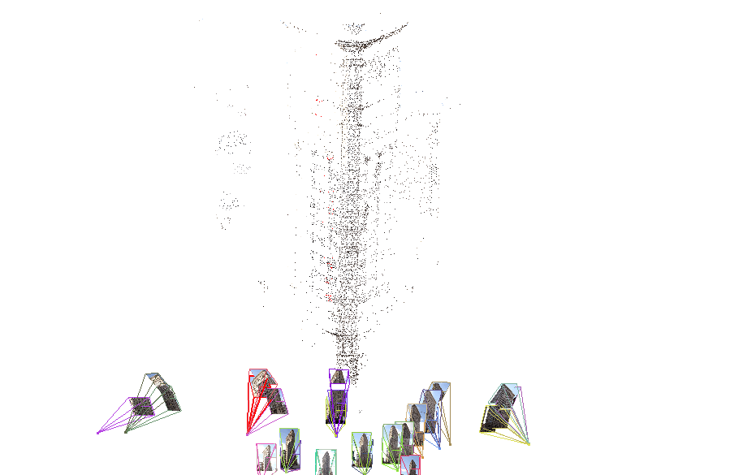
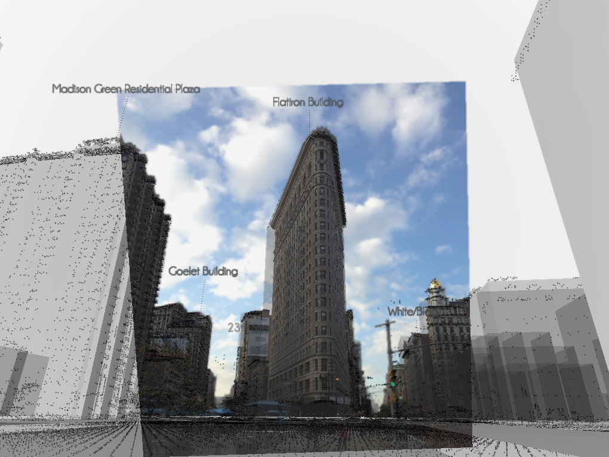

## Non traditional 3D Mapping, from pointClouds to GeoJSON Polygons

“* …the only place on earth where all places are — seen from every angle, each standing clear, without any confusion or blending*" The Aleph, Jorge Luis Borges

The following is a brief documentation of a month of research on point clouds for mapping and some of the tools I made in the way.

### Working with Point Clouds

Point clouds are not new, but they are trending like never before. New devices with more computational power and more memory are making this technology common and ubiquitous. From videos games to [the big screen](https://www.youtube.com/watch?v=p6NNQ3VAb3w&list=UUjnYk44Aj9E634TPucpIXnQ), point are being use and generated at increasing amounts. 

#### LIDar data


Not to long after the invention of the lasers on the ’60. Scientist have been mounting laser scanners under planes to sends pulses of light to a surface and measure the precise distance to it. Together with the geolocation of this points this technology is known as LIDAR. 

In the last years a new generation of smaller devices comes to the market. Giving the possibility to mount them on cars and backpacks, and preserving every single point from a particular place like holographic glass snow globes.

According to the closing law of gestalt psychology our perception is really good at making sense of this clusters of dots. Our mind completes the empty spots and makes sense of them. The more point of views your sources have the closer the map looks like the terrain.

For that is important for this technology to be hable to merge and clean this type of data. There are a couple of programs that let you do this at this scale, the best open source application I found was [CloudCompare](http://www.danielgm.net/cc/).


Thinking bigger also means thinking on serving and analyzing this information for that loading this point to a GeoSpacial database is crucial. [PostGIS](http://postgis.net/) can be use to cross this information with any map. An example of that process is [this tutorial from Yuriy Czoli](https://gist.github.com/YKCzoli/3605e014b8ed09a571e5) were he use altitud of the points to set the the height of building on [OpenStreetMap](http://www.openstreetmap.org/).

In my case I was interested on seen how [OpenStreetMap](http://www.openstreetmap.org/) polygons could look more accurate.


Coming from an artistic approach and not knowing much about GIS, I decide to try my own way into this technology. For start making [some scripts](https://github.com/tangrams/LIDar-tools) to convert Lidar data to other formats, [export them to PostGIS](https://gist.github.com/patriciogonzalezvivo/229c5cd4001c2ed45ec6) and extract single buildings or tiles from it.

All of this you can find at this [Lidar-Tools repository](https://github.com/tangrams/LIDar-tools): 

* ```las2SM```: re-project lidar files (.laz/.las) to [Spherical Mercator (epsg:3857)](http://epsg.io/3857) 

* ```las2tile```: crop a tile from a lidar files (.laz/.las) and project to [Spherical Mercator (epsg:3857)](http://epsg.io/3857) 

* ```las2ply```: export lidar files (.laz/.las) into .ply format

* ```getPointsForID```: once a PostGIS database is loaded with lidar information of a region, this scritps get all the points inside a tagged OSM polygon by providing the OSM ID.

#### Making point-clouds from pictures

But, how owns a Lidar any way? Well, they are expensive devices, that only companies and institutions can afford. As far as I know that how “open” this technology goes.

Hopefully there is a way around, a relative “old” technique call photogrammetry that requires just a regular camera and some patience (specially to compile the available open software). It was original develop on 2006 under the name of PhotoTurism. What it does is to stitch photographies together finding distinctive assets and cross similarities to then construct 3D point clouds.


Today the most most popular applications using this technology are [PhotoSynth](https://photosynth.net/) and [123D Catch](http://www.123dapp.com/catch). The are still some powerful open source equivalent such us [Bundler](http://www.cs.cornell.edu/~snavely/bundler/) and [VisualSfM](http://ccwu.me/vsfm/).

<iframe width="575" height="323" src="//www.youtube.com/embed/vpTEobpYoTg" frameborder="0" allowfullscreen></iframe>

“*Bundler takes a set of images, image features, and image matches as input, and produces a 3D reconstruction of camera and (sparse) scene geometry as output. The system reconstructs the scene incrementally, a few images at a time, using a modified version of the [Sparse Bundle Adjustment](http://users.ics.forth.gr/~lourakis/sba/) package of Lourakis and Argyros as the underlying optimization engine. Bundler has been successfully run on many Internet photo collections, as well as more structured collections*.”

My work field start by taking pictures of the Flatiron. I read and following [Jesse’s tutorial](http://wedidstuff.heavyimage.com/index.php/2013/07/12/open-source-photogrammetry-workflow/) to learn how to take better pictures, how to process them with [VisualSfM](http://ccwu.me/vsfm/) and clean the dense reconstruction with [MeshLab](http://meshlab.sourceforge.net/).

Once I read the tutorial found to be a really smooth and flexible work flow. Pictures can be taken in different moments of the day and and cameras. In may case I finishing adding a bunch of them with my cellphone because I was interested on using the geo position from the GPS, which ends up being a hole new problem. 



The result of the above process are: a point clouds of feature markers that contain information of the cameras called ```bundle.rd.out``` (from the [bundler](http://www.cs.cornell.edu/~snavely/bundler/) algorithm ) and a big point cloud product of the dense reconstruction (from the [pmvs2](http://grail.cs.washington.edu/software/pmvs/) ). Both files are coherent between each other. They share the same space coordinates. You can load them and experiment with them using [this addon](https://github.com/patriciogonzalezvivo/ofxBundle) for [openFrameworks](http://openframeworks.cc/). In order to import this data constructed just from photos to a PostGIS server I had to find a way to geo reference this point clouds.

After taking more photos width my cellphone and using the GPS location hidden on the EXIF header, I was hable to extract the centroid, approximated scale and base rotation to level the cameras over the surface. The final adjustments (translation and precise orientation) were made by hand. The reason for that is the incredible noise GPS data thanks the well know [“urban canyon”](http://en.wikipedia.org/wiki/Street_canyon) effect that makes satellites signals bounce between buildings.

On the following images you can see the result of this process. The Flatiron points, photo images and extruded OSM polygons are display together. The abstract universe of maps contrasted side by side with photographs and virtual points.



<iframe src="//player.vimeo.com/video/110926839?title=0&amp;byline=0&amp;portrait=0" width="575" height="323" frameborder="0" webkitallowfullscreen mozallowfullscreen allowfullscreen></iframe>

### From Point Clouds to Meshes

Once I got a coherent universe of point cloud correctly geolocated was time to load them to my PostGIS database together with [our OSM Metro Extracts](https://mapzen.com/metro-extracts). For that you can follow [this short tutorial](https://gist.github.com/patriciogonzalezvivo/229c5cd4001c2ed45ec6). The reason to load the OSM Metro Extract?  You can use PostGIS geo-spacial query functions to extract with surgical precision a specific feature. Like for example the “Flatiron Building” or ```node:2517056822```. Inside [the repository LIDar-Tools](https://github.com/tangrams/LIDar-tools) you will find a Python script call ```getPointsForID``` that will let you do this extraction with out knowing how to make a PostGIS Query.

With al the points of the Flatiron a was hable to perform a Poisson Reconstructive Algorithm (using [CGAL’s implementation](http://doc.cgal.org/latest/Surface_reconstruction_points_3/)) to construct a mesh of it. Once again you can find this tool at [the LIDar-Tools repository](https://github.com/tangrams/LIDar-tools/tree/master/xyz2mesh) in the sub folder call [```xyz2Mesh```](https://github.com/tangrams/LIDar-tools/tree/master/xyz2mesh). Alternatively you can use [MeshLab’s](http://meshlab.sourceforge.net/), but I found that CGAL’s implementation works better. 


### Meshes to GeoJSON Polygons

Although I love how meshes looks they have to much information for what OSM can hold. This last step on the process is about downsampling the information we collect to something that could be uploaded and shared in the web. 

OSM database doesn’t know to much about 3D Meshes. Basically all buildings are polygons with altitudes. Like layers of a cake, polygons sits once on top of the other. In order to make our mesh compatible with OSM we have to cut “sliced” as cheese. In [this repository](https://github.com/tangrams/Mesh2OSMSlicer) you will find a program that does exactly that. Slice the mesh inch by inch, checking every slice with the previous one, if it finds a significant change on the area size, will add a that cut on top of our cake. 


## Conclusion

For this process I had use an extraordinary convenient sample. Beside being a beautiful building The Flatiron is perfectly isolated construction. To apply this process any other buildings extra steps have to be add to this pipeline. This was mostly a proof of concept about the potential of mixing lidar information with SfM reconstructions as a way to crowd found point clouds. One that points to a future where people can contribute to open source initiatives just by sharing their pictures. 

<iframe src="//player.vimeo.com/video/111857991?title=0&amp;byline=0&amp;portrait=0" width="575" height="323" frameborder="0" webkitallowfullscreen mozallowfullscreen allowfullscreen></iframe>